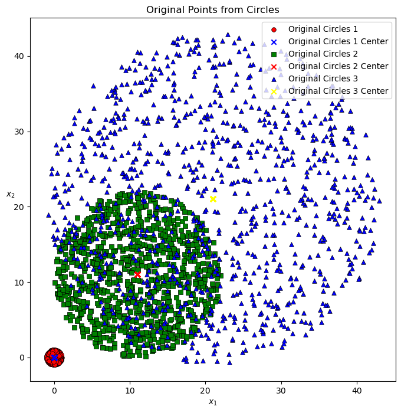

# 🔵 K-Means Clustering — Geometry, Accuracy & Limitations

A focused study on **K-Means behavior under controlled geometric conditions** — generating synthetic circular and elliptical datasets, measuring clustering accuracy, and benchmarking against alternative algorithms.

---

## 🎯 What This Project Does

> *"When K-Means knows exactly where the clusters should be — how well does it actually perform, and where does it break down?"*

Uses synthetically generated data with known ground truth to rigorously evaluate K-Means performance, expose its geometric limitations, and propose better-suited alternatives.

---

## 🔬 Experiments

**1. Baseline — Circular Clusters**
- Generated 3,000 points across 3 circles of vastly different radii (r = 1, 11, 22)
- Initialized K-Means centroids at exact circle centers — best-case scenario
- Visualized original distribution vs. post-clustering assignment

**2. Accuracy Measurement**
- Computed clustering accuracy by matching predicted labels to ground truth
- Handled label permutation problem (cluster 0 ≠ original class 0) via optimal label alignment

**3. Distance Analysis**
- Compared mean intra-cluster distance: K-Means result vs. original circle membership
- Quantified how much K-Means distorts natural groupings due to scale sensitivity

**4. Algorithm Comparison**
- Evaluated DBSCAN and Gaussian Mixture Models (GMM) as alternatives
- Justified selection based on cluster geometry (arbitrary shapes vs. elliptical distributions)

**5. Elliptical Edge Case**
- Generated vertically-directed ellipses with two parameter sets
- Demonstrated K-Means boundary distortion when clusters are non-spherical

---

## 💡 Key Finding

> K-Means struggles when clusters have vastly different radii — the large-radius cluster dominates distance calculations, pulling centroids and misclassifying boundary points. GMM handles this significantly better by modeling each cluster's covariance independently.

---

## 🛠️ Tech Stack

`Python` · `NumPy` · `pandas` · `scikit-learn` · `Matplotlib`

> Algorithms used: `KMeans` · `DBSCAN` · `GaussianMixture`

---

## 📁 Key Files

| File | Description |
|---|---|
| `Home_Work.ipynb` | Full analysis — data generation, clustering, accuracy, visualizations |

> No external dataset required — data is synthetically generated in-notebook.

---

## 📊 Setup

| Parameter | Value |
|---|---|
| Total points | 3,000 (1,000 per cluster) |
| Cluster centers | (0,0) · (11,11) · (21,21) |
| Circle radii | 1 · 11 · 22 |
| K-Means init | True circle centers (oracle initialization) |
| Alternative algos | DBSCAN · GMM |
